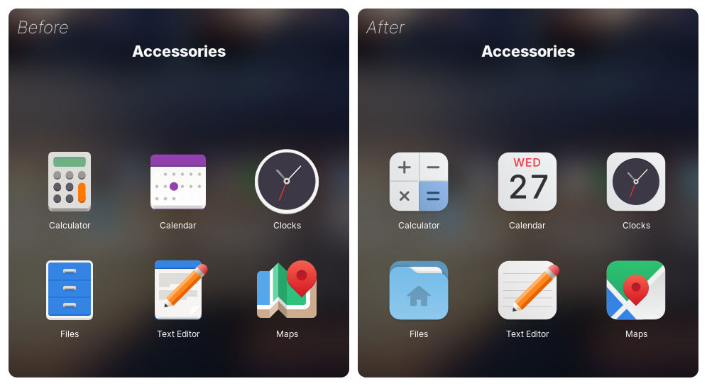
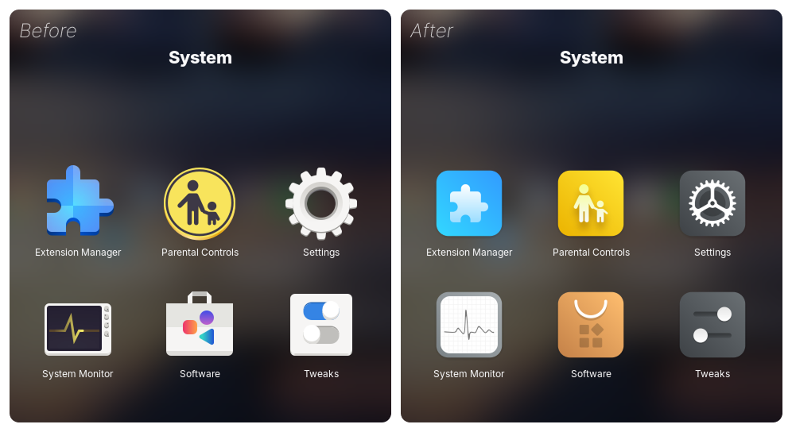
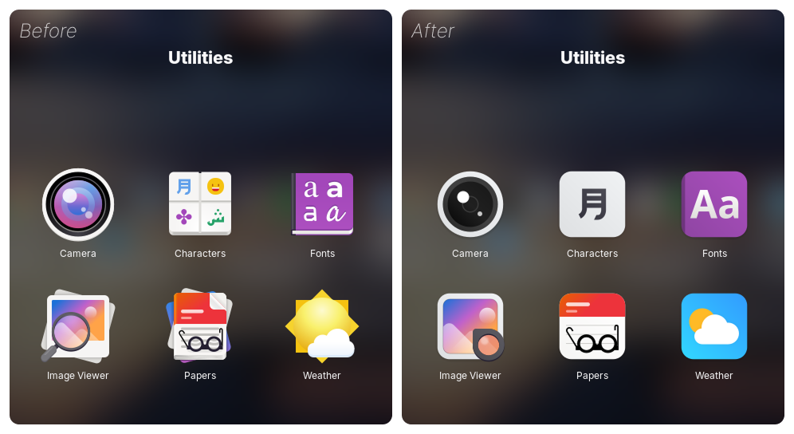
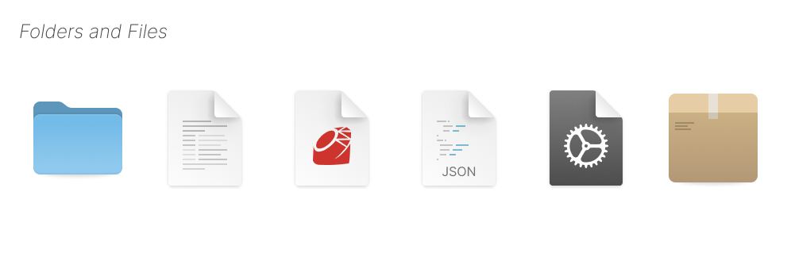

<p align="center">
  
</p>

<p align="center">
  A modern icon theme for GNOME desktop.
</p>

## Installation

Run the installation script:
```shell
./install.sh
```

# Previews

<p align="center">
  
</p>

<p align="center">
  
</p>

<p align="center">
  
</p>

<p align="center">
  
</p>

## Support

If you like this project, consider supporting its development:

[](https://www.paypal.com/donate/?hosted_button_id=KQXTZ4MH4JRZU)

## License

[GPL-3.0](https://www.gnu.org/licenses/gpl-3.0.en.html)

Copyright (c) 2025, Alexandre Magro